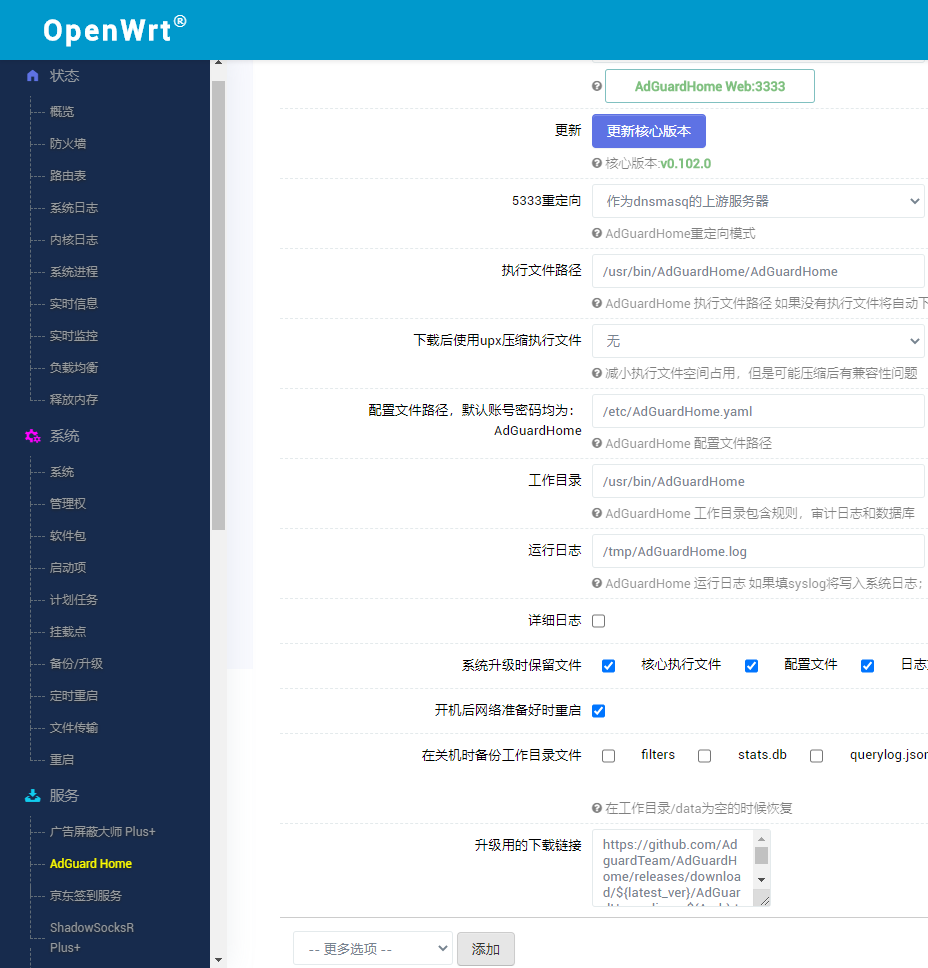
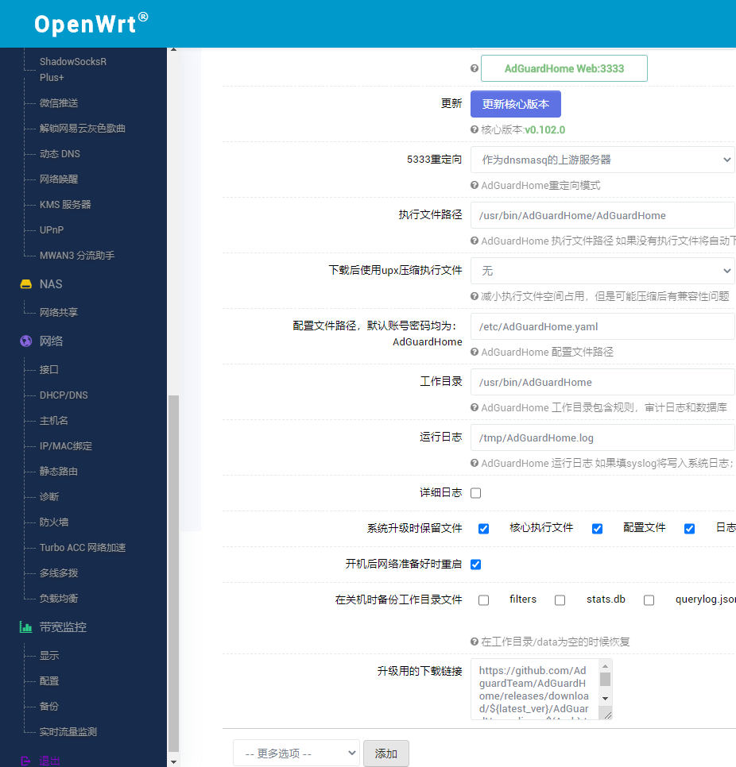

# lede大佬openwrt-X86-64追新版
# P3TERX大佬opwnert固件云编译脚本
# firker大佬opwnert固件设置

云编译脚本地址：https://github.com/P3TERX/Actions-OpenWrt

固件源码地址：https://github.com/coolsnowwolf/lede

Openwrt-x86 固件图

> ip：192.168.1.1 密码：password

